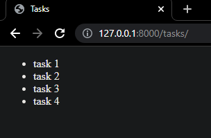
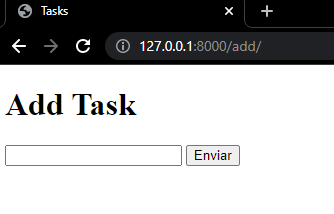

In this case we are creating a tasks app using Django

- First we start the project

```powershell
django-admin startproject tasks
```

- Then we go to settings.py and add the new app under installed apps.

```python
INSTALLED_APPS = [
    'tasks',
    'django.contrib.admin',
    'django.contrib.auth',
    'django.contrib.contenttypes',
    'django.contrib.sessions',
    'django.contrib.messages',
    'django.contrib.staticfiles',
]
```

- Next we cd into the new tasks folder and create a .gitignore file

```powershell
# Byte-compiled / optimized / DLL files
__pycache__/
*.py[cod]
*$py.class
*.pyc
```

- Because we are adding an add function we have to add it to urls.py as a new path

```python
path('tasks/', views.index, name="index")
```

- Next if there’s no views.py file then we have to create it so that we can start to create our functions. In order to test it we create an array of tasks and then define our index:

```python
from django.shortcuts import render

tasks = ['task 1', 'task 2', 'task 3', 'task 4']

# views go here

def index(request):
    return render(request, 'tasks/index.html', {
        "tasks": tasks
    })
```

- Now we need to create our index file, prior to creating a file we have to create a new folder called templates, this is going to be our directory for our templates then another one called tasks and then our html index that should look like this:

```html
<!DOCTYPE html>
<html lang="eng">
  <head>
    <title>Tasks</title>
  </head>
  <body>
    <ul>
      <!--We are adding a loop instead of 
	hardcoding the tasks-->
      
      <li>{{task}}</li>
      
    </ul>
  </body>
</html>
```

We should be able to see something like this:



- Now that we are able to see our list of tasks we can add the new add function which will allow us to add new tasks in views.py

```python
def add(request):
    return render(request, 'tasks/add.html')
```

- ON urls.py we add the new path:

```python
path('add/', views.add, name="add")
```

- Create the add.html file in the template/tasks directory. Inside the body of the add.html should look like this:

```html
<body>
  <h1>Add Task</h1>
  <form action="">
    <input type="text" name="task" />
    <input type="submit" />
  </form>
</body>
```

We should be able to see something like this:



However, what we’ve just done isn’t necessarily the best design, as we’ve just repeated the bulk of that HTML in two different files. Django’s templating language gives us a way to eliminate this poor design: [template inheritance](https://tutorial.djangogirls.org/en/template_extending/)
. This allows us to create a `layout.html`
 file in the templates/tasks directory that will contain the general structure of our page:

```html
<!DOCTYPE html>
<html lang="en">
  <head>
    <title>Tasks</title>
  </head>
  <body>
     
  </body>
</html>
```

Because we are using  non-Html logic, we can update our index.html file:

```html
 
<h1>Tasks:</h1>
<ul>
  
  <li>{{ task }}</li>
  
</ul>

```

On the same file we’re going to link the add.html file so that when we click it, it redirects us to the add a task

```html
<a href="">Add a New Task</a>
```

So our index.html file should look like this:

```html
 
<h1>Tasks:</h1>
<ul>
  <!--We are adding a loop instead of hardcoding the tasks-->
  
  <li>{{task}}</li>
  
</ul>
<a href="">Add a New Task</a>

```

In order to make sure the form actually does something when a user submits it, we can add an action in the add.html file:

```html
<form action="" method="post"></form>
```

What this does is that once the form is submitted, we’ll be routed back to the add URL. However, we still need to add a bit more to the form, Django requires a token to prevent [Cross-Site Request Forgery (CSRF) Attack](https://portswigger.net/web-security/csrf) .

To solve this problem, when Django sends a response rendering a template, it also provides a **CSRF token** that is unique with each new session on the site. Then, when a request is submitted, Django checks to make sure the CSRF token associated with the request matches one that it has recently provided. Therefore, if a malicious user on another site attempted to submit a request, they would be blocked due to an invalid CSRF token. This CSRF validation is built into the [Django Middleware](https://docs.djangoproject.com/en/4.0/topics/http/middleware/) framework, which can intervene in the request-response processing of a Django app. We won’t go into any more detail about Middleware in this course, but do look at the [documentation](https://docs.djangoproject.com/en/4.0/topics/http/middleware/) if interested!

To incorporate this technology into our code, we must add a line to our form in `add.html`.

```html
<form action="" method="post">
  
  <input type="text" name="task" />
  <input type="submit" />
</form>
```

Now we are going to add a function that takes the information from the form and add it to tasks. So we go to views.py and import forms and create a new class that is going to represent the form.

```python
from django import forms
class NewTaskForm(forms.Form):
    # get input from user
    task = forms.CharField(label="New Task")
```

Now when we render add.html we can add some context and give the template access to the form variable:

```python
def add(request):
    return render(request, 'tasks/add.html', {
        # giving the template access to the variable called form
        "form": NewTaskForm()
    })
```

Let’s go to the add.html file and remove the input text and add the following {{form}}, it should look like this:

```html
<form action="" method="post">
   {{form}}<!--here-->
  <input type="submit" />
</form>
```

We can make upgrades now without the need to edit the HTML, for example, if we want to add a number of priority the task should have, we do the following:

```python
class NewTaskForm(forms.Form):
    # get input from user
    task = forms.CharField(label="New Task")
    # add priority to the task
    priority = forms.IntegerField(label="Priority",
                                  min_value=1, max_value=10)
```

On views.py we can now add our logic to take the input from the user. Now that we have a form set up, let’s work on what happens when a user clicks the submit button. When a user navigates to the add page by clicking a link or typing in the URL, they submit a `GET` request to the server, which we’ve already handled in our `add` function. When a user submits a form though, they send a `POST`
 request to the server, which at the moment is not handled in the `add` function. We can handle a `POST` method by adding a condition based on the `request`argument our function takes in. The comments in the code below explain the purpose of each line:

```python
#client and server side validation
def add(request):
    # Check if the method is POST
    if request.method == 'POST':
        # Take in the data the user submitted and save it as form
        form = NewTaskForm(request.POST)
        # Check if form data is valid (server-side)
        if form.is_valid():
            # this will give me access to the data submitted by the user
            task = form.cleaned_data["task"]
            # Add the task to the list of tasks
            tasks.append(task)
        else:
            # If the form is invalid, re-render the page with existing information.
            return render(request, 'tasks/add.html', {
                'form': form
            })

    return render(request, 'tasks/add.html', {
        # giving the template access to the variable called form
        "form": NewTaskForm()
    })
```

When a task is submitted, redirect back to the page of tasks.

```python
#Once a new task is submitted, redirect the user to the list of tasks
return HttpResponseRedirect(reverse('index'))
```

A quick note: in order to redirect the user after a successful submission, we need a few more imports, and now that we are able to submit tasks, we can remove the ones we manually added and leave an empty list.

```python
from django.urls import reverse
from django.http import HttpResponseRedirect

tasks = ['task 1', 'task 2', 'task 3', 'task 4'] #remove all 4 tasks and leave it empty
```

We should be able to add new tasks and once we create a new one, we should be redirected to the list of tasks without any issues. However, this means that any user that access the link will be able to see the same screen, the same tasks. First we need to remove the global tasks variable stated above and store tasks inside of the user’s session. So inside the index route, we add a line like this:

```python
if "tasks" not in request.session:
		request.session["tasks"] =[]
```

This is how our function should look like on views.py

```python
def add(request):
    # Check if the method is POST
    if request.method == 'POST':
        # Take in the data the user submitted and save it in the form variable
        form = NewTaskForm(request.POST)
        # Check if form data is valid (server-side)
        if form.is_valid():
            # this will give me access to the data submitted by the user
            task = form.cleaned_data["task"]
            # Add the task to the list of tasks
            request.session["tasks"] += [task]
            # Once a new task is submitted, redirect the user to the list of tasks
            return HttpResponseRedirect(reverse('index'))
        else:
            # If the form is invalid, re-render the page with existing information.
            return render(request, 'tasks/add.html', {
                'form': form
            })
```

We are almost there. Before Django will be able to store this data, we must run `python manage.py migrate`
 in the terminal.

```powershell
python manage.py migrate
```

Finally, for the best user experience, when there’s an empty list we want to have a text that indicates that there’s no task. So we can go to our index.html and

```html
<ul>
  <!--We are adding a loop instead of hardcoding the tasks-->
  
  <li>{{task}}</li>
  <!--Adding no tasks when the list is empty-->
  
  <li>No tasks.</li>
  
</ul>
```

If the server isn’t running, stop it and run it again, and that’s it.
